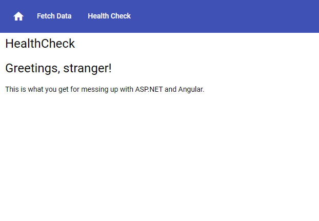
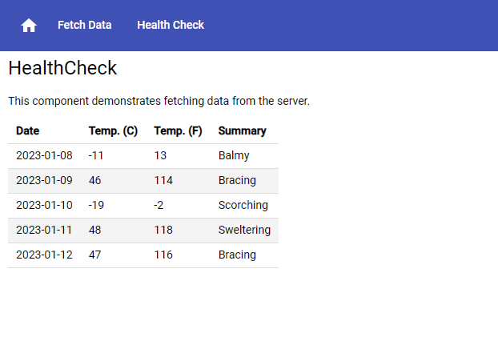
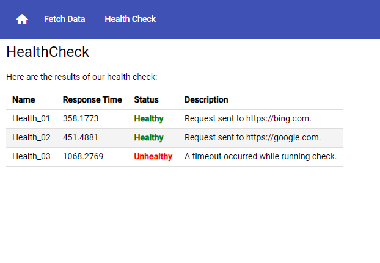
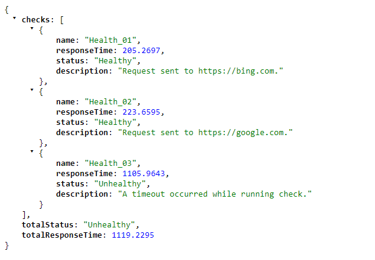
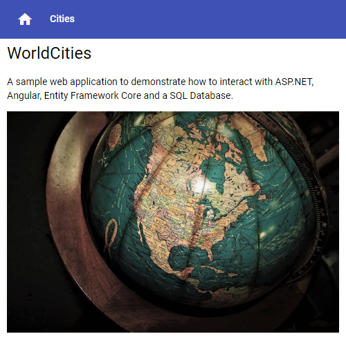
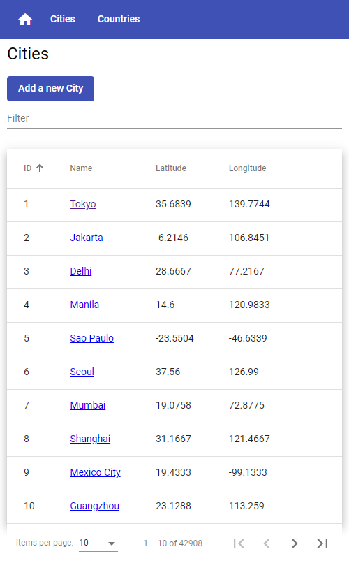
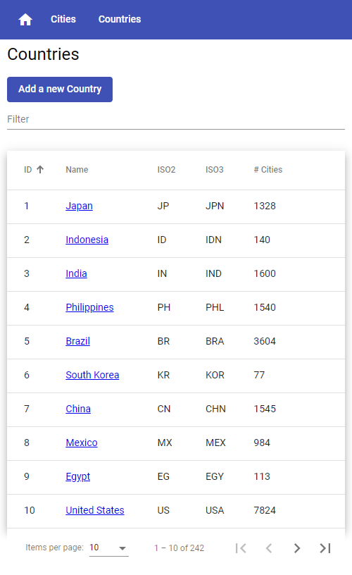

# ASP.NET Core 6 and Angular

Based on the Web Applications built in the Book 'ASP.NET Core 6 and Angular Fifth Edition' by Valerio De Sanctis (Packt, 2022).

1. HealthCheck (Chapters 02-04)
1. WorldCities (Chapters 05-13)

## Prerequisites

- Visual Studio 2022
  - ASP.NET and web workload
  - Node.js development workload

## Getting started

1. Clone this repository.
1. Open the solution file.
1. Configure multiple startup projects setting and select Start for each project's action.
1. Build the solution.
1. From Visual Studio: Press F5 to launch both projects in debug mode.
1. Or from VS Code: Execute `npm run start` and then `npm run backend` to launch both projects.

## Screen captures

### HealthCheck

  
_Home page_

  
_Fetch data_

  
_Health check_

  
_Health check api_

### WorldCities

  
_Home page_

  
_Cities page_

  
_Countries page_

## License

```markdown
MIT License

Copyright (c) 2023 Felipe Romero

Permission is hereby granted, free of charge, to any person obtaining a copy
of this software and associated documentation files (the "Software"), to deal
in the Software without restriction, including without limitation the rights
to use, copy, modify, merge, publish, distribute, sublicense, and/or sell
copies of the Software, and to permit persons to whom the Software is
furnished to do so, subject to the following conditions:

The above copyright notice and this permission notice shall be included in all
copies or substantial portions of the Software.

THE SOFTWARE IS PROVIDED "AS IS", WITHOUT WARRANTY OF ANY KIND, EXPRESS OR
IMPLIED, INCLUDING BUT NOT LIMITED TO THE WARRANTIES OF MERCHANTABILITY,
FITNESS FOR A PARTICULAR PURPOSE AND NONINFRINGEMENT. IN NO EVENT SHALL THE
AUTHORS OR COPYRIGHT HOLDERS BE LIABLE FOR ANY CLAIM, DAMAGES OR OTHER
LIABILITY, WHETHER IN AN ACTION OF CONTRACT, TORT OR OTHERWISE, ARISING FROM,
OUT OF OR IN CONNECTION WITH THE SOFTWARE OR THE USE OR OTHER DEALINGS IN THE
SOFTWARE.

---

Basic World Cities Database is licensed under the Creative Commons Attribution 4.0
license as described at: <https://creativecommons.org/licenses/by/4.0>.
```
